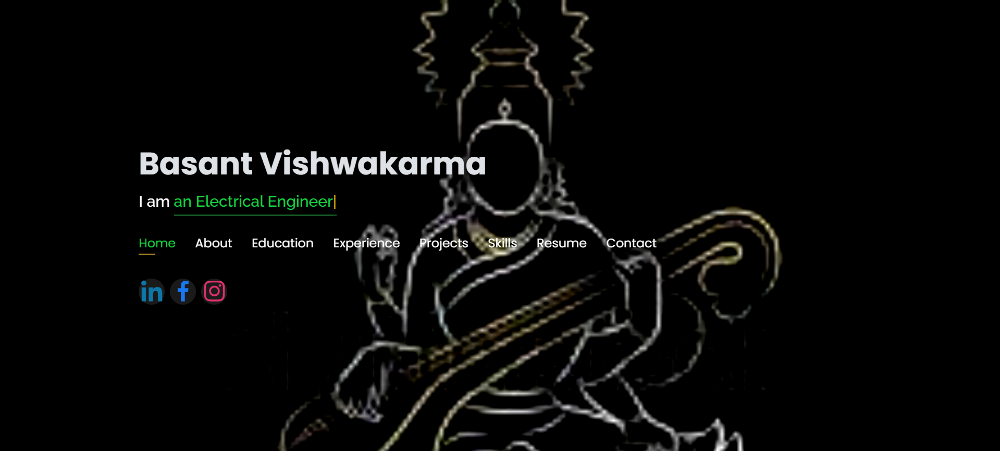
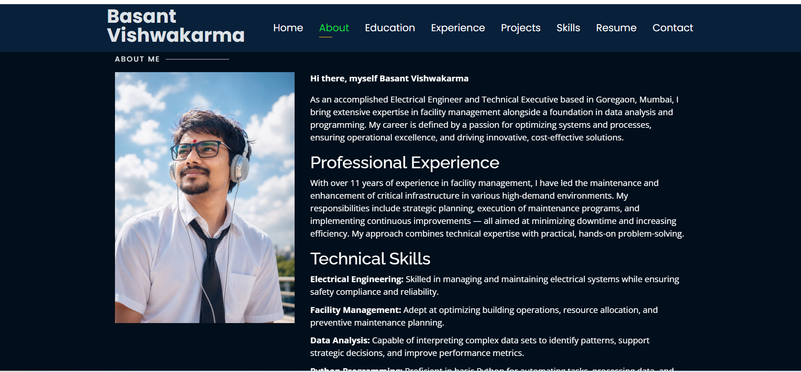
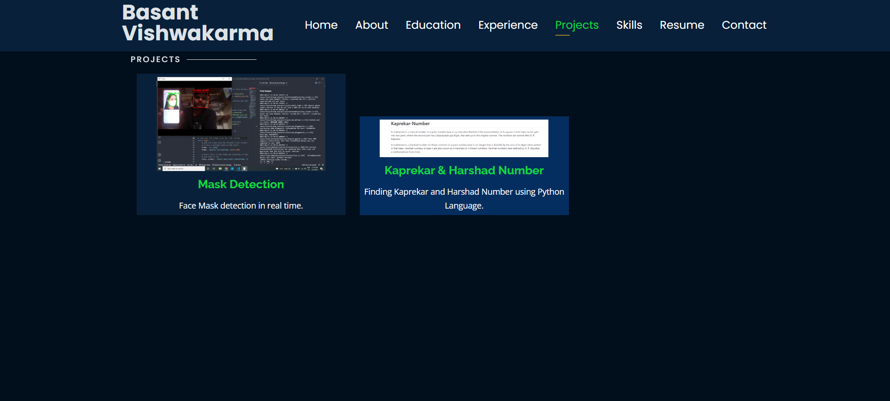

# 🏢 Personal Portfolio Website 🚀
### Assistant Facility Manager & Technical Executive

Welcome to the source repository for my personal portfolio! This is a fully responsive, high-performance static website built to showcase my expertise in **Critical Banking Infrastructure, Facility Operations Management**, and **Technical Automation (Python)**.

🌐 **Live Website:** [thebasantdiary.github.io](https://thebasantdiary.github.io/)

---

<p align="center">
  <a href="https://github.com/thebasantdiary/thebasantdiary.github.io/commits/main">
    
  </a>
  <a href="https://thebasantdiary.github.io">
    
  </a>
  <a href="https://www.linkedin.com/in/thebasantdiary/">
    
  </a>
</p>

---

## 📱 Website Previews

| 🏠 Home Section | ⚡ Skills & Experience | 📂 Projects Dashboard |
|---|---|---|
|  |  |  |

---

## ✨ Key Features
* 📱 **Fully Responsive Layout:** Optimized flawlessly for mobile, tablet, and desktop interfaces.
* ⚡ **Performance-Focused:** Fast-loading, valid HTML5 & CSS3 with smooth scrolling native architecture.
* 📝 **Interactive Request System:** Integrated dynamic Google Forms interface to securely handle professional CV download requests.
* 🎨 **Engaging Animations:** Utilizes `Typed.js` and `AOS` (Animate on Scroll) for a premium user journey.

---

## 🛠️ Portfolio Architecture

### 📚 Core Sections Included
* **About & Profile:** Overview of my operational role managing critical infrastructure environments.
* **Core Competencies:** Categorized overview spanning BMS, 100% Uptime Power, Safety Compliance, and Automation.
* **Professional Experience:** Detailed career milestones from engineering to facility management frameworks.
* **Technical Toolkit:** Dedicated grid displaying programming languages (Python), Web tools, and repositories.
* **Contact Gateway:** Real-time channel for recruitment managers to schedule meetings or request offline resumes.

### 🧰 Tech Stack
* **Frontend Core:** HTML5, CSS3, JavaScript ES6
* **UI Framework:** Bootstrap (Responsive layouts and customized grid spacing)
* **Hosting Pipeline:** GitHub Pages (Static build deployment)

---

## 🚀 Installation & Deployment Guide

Want to fork this project to deploy your own personal portfolio? Follow these simple steps:

### 1. Clone the Workspace
```bash
git clone [https://github.com/thebasantdiary/thebasantdiary.github.io.git](https://github.com/thebasantdiary/thebasantdiary.github.io.git)
cd thebasantdiary.github.io# thebasantdiary.github.io
# thebasantdiary.github.io
# thebasantdiary.github.io
# thebasantdiary.github.io
